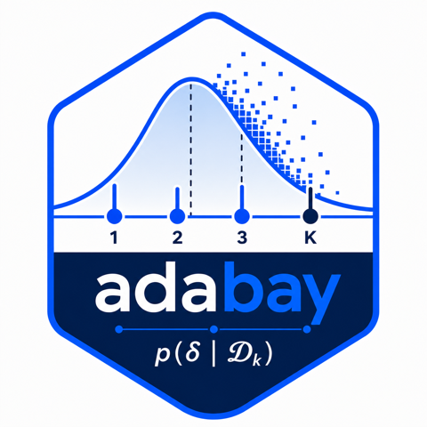

# adabay 

`adabay` is an R package for the rapid evaluation and calibration of Bayesian group sequential designs (GSDs) across continuous, binary, count and time-to-event endpoints. It implements the semi-simulation framework described in the companion manuscript: virtual trials are simulated by Monte Carlo, but per-look posteriors are computed in closed form by approximating any user-specified prior with a finite mixture of conjugate components.

## Installation

From the bundled source tarball:

```r
install.packages("adabay_0.1.0.tar.gz", repos = NULL, type = "source")
```

or, when working from a checkout of the supplementary materials:

```r
# install.packages("devtools")
devtools::install_local("Code/adabay")
```

The optional `RBesT` package is recommended for fitting non-conjugate priors via `fit_mixture()`. The package depends on `Rcpp`, `parallel`, `graphics` and `stats`, and uses `ggplot2` and `ggsci` for plot methods if available.

## Workflow

A typical workflow has four steps: build a design, prior, and decision rule, then call `evaluate_design()`. The same function is the entry point for both the single-design fused path (pass an `adabay_design`) and the cached grid-evaluation path (pass an `adabay_cache` produced by `build_cache()`).

```r
library(adabay)

des <- set_design(
  endpoint     = "binary",
  n_per_look   = c(760, 1520, 2280, 3040, 3800),
  effect_scale = "risk_difference",
  alternative  = "less"
)

pri <- set_prior(
  endpoint = "binary",
  arms = list(c = list(family = "beta", a = 1, b = 1),
              t = list(family = "beta", a = 1, b = 1))
)

dec <- set_decision(
  efficacy = list(list(threshold_effect = 0, threshold_prob = 0.99)),
  futility = list(list(threshold_effect = 0, threshold_prob = 0.90)),
  futility_binding = TRUE
)

oc <- evaluate_design(des,
  prior    = pri,
  decision = dec,
  effect   = list(theta_c = 0.33, theta_t = 0.28),
  n_trials = 1e6,
  cores    = 4,
  seed     = 1L
)

print(oc)
plot(oc)
plot(oc, file = "adrenal.jpeg", width = 7, height = 4, dpi = 300)
```

## Supported endpoints

| Endpoint    | Conjugate kernel              | Effect scales |
|-------------|-------------------------------|---------------|
| Continuous  | Normal, Normal--inverse-gamma | mean_difference, standardised_mean_difference |
| Binary      | Beta                          | risk_difference, risk_ratio, odds_ratio       |
| Count       | Gamma                         | rate_difference, rate_ratio, log_rate_ratio   |
| Time-to-event | Gamma                       | hazard_ratio, log_hazard_ratio                |

## Top-level functions (verb_object snake_case)

| Function            | Purpose |
|---------------------|---------|
| `set_design()`      | Specify the design skeleton (endpoint, look schedule, scale) |
| `set_prior()`       | Specify per-arm conjugate or mixture-of-conjugate priors |
| `set_decision()`    | Specify per-look efficacy and futility decision rules |
| `set_accrual()`     | Specify recruitment, follow-up and dropout |
| `fit_mixture()`     | Approximate a non-conjugate prior by a conjugate mixture |
| `build_cache()`     | Cache per-look tail probabilities for grid evaluation |
| `evaluate_design()` | Evaluate operating characteristics; polymorphic on an `adabay_design` (fused simulate-and-aggregate path) or an `adabay_cache` (cheap aggregation from a pre-built cache) |
| `calibrate_design()`| Search a threshold grid for target operating characteristics |
| `summarise_oc()`    | Tidy summary across designs in a grid |

## Worked examples

Reproducible scripts for the four case studies in the manuscript are provided under `inst/examples/`:

* `transform2.R` -- continuous endpoint (TRANSFORM-2 esketamine for treatment-resistant depression)
* `adrenal.R` -- binary endpoint (ADRENAL re-design)
* `bnt162b2.R` -- count endpoint (Pfizer--BioNTech BNT162b2 COVID-19 vaccine trial)
* `checkmate141.R` -- time-to-event endpoint (CheckMate-141 head and neck cancer trial)

## Performance

The slow per-trial posterior integrals are implemented in C++ via Rcpp using a 64-node Gauss--Legendre quadrature. The trial-level loop is parallel-friendly through `parallel::mclapply` (POSIX) or `parallel::parLapply` (Windows), with reproducibility under parallelism guaranteed by the L'Ecuyer combined multiple-recursive generator.

Cross-package wall-clock and per-virtual-trial timing comparisons against gsbDesign, BATSS and adaptr are reported in Section 7 of the companion manuscript (binary ADRENAL, count BNT162b2 and time-to-event CheckMate-141 case studies).

## Plot styling

`plot.adabay_oc()` uses `ggplot2::theme_bw()` and the BMJ palette via `ggsci::scale_fill_bmj()` (with a sensible fallback when `ggsci` is not installed). When the `file` argument is supplied, the plot is written via `ggplot2::ggsave()`; the file extension determines the device (`.jpeg`, `.jpg`, `.png`, `.pdf`).

## Licence

MIT (see [LICENSE](LICENSE)).
